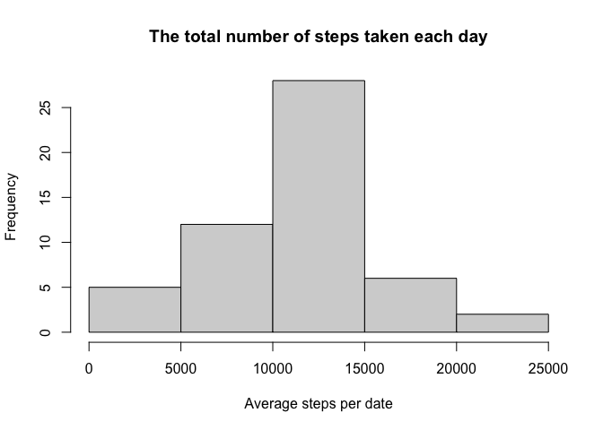
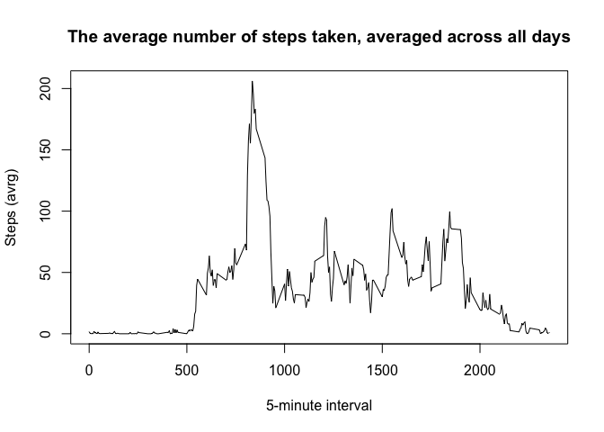
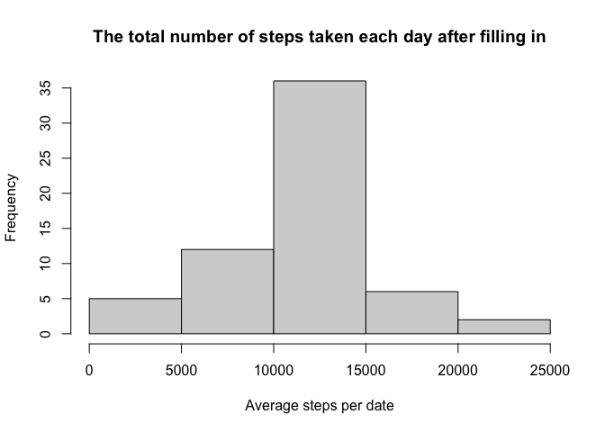
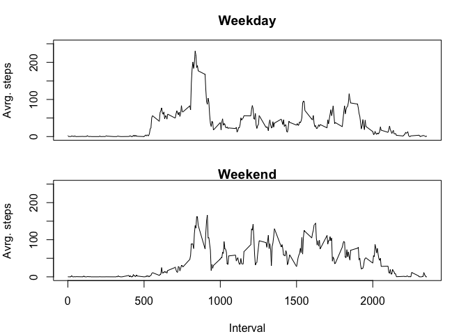

## Loading and preprocessing the data

```r
library(dplyr)
```

```
## 
## Attaching package: 'dplyr'
```

```
## The following objects are masked from 'package:stats':
## 
##     filter, lag
```

```
## The following objects are masked from 'package:base':
## 
##     intersect, setdiff, setequal, union
```

```r
if (!file.exists("./activity.csv")) { 
    flSrc <- "./activity.zip"
    unzip(flSrc,exdir="./")  # unzip file 
}
act <- read.csv("./activity.csv", colClasses = c("numeric", "Date", "numeric"))
```
<br>
<br>

## What is mean total number of steps taken per day?  

```r
hist(summarize(.data = act, .by = date, dateAvrg =sum(steps))$dateAvrg, main = "The total number of steps taken each day",
     xlab = "Average steps per date")
```

<!-- -->

### The **mean** and total number of steps taken per day

```r
mean(summarize(.data = act, .by = date, dateAvrg =sum(steps))$dateAvrg, na.rm = TRUE)
```

```
## [1] 10766.19
```

### The **median** total number of steps taken per day

```r
median(summarize(.data = act, .by = date, dateAvrg =sum(steps))$dateAvrg, na.rm = TRUE)
```

```
## [1] 10765
```
<br>
<br>

## What is the average daily activity pattern?

```r
actInterval <- summarize(.data = act, .by = interval, intervalAvrg =mean(steps, na.rm = TRUE))
plot(actInterval$interval, actInterval$intervalAvrg, type = "l", 
     main="The average number of steps taken, averaged across all days",
     xlab = "5-minute interval",
     ylab = "Steps (avrg)")
```

<!-- -->

### The 5-minute interval, containing the maximum number of steps (on average across all the days in the dataset), is:

```r
actInterval[actInterval$intervalAvrg==max(actInterval$intervalAvrg),1]
```

```
## [1] 835
```
<br>
<br>

## Imputing missing values

### The total number of missing values in the dataset:

```r
sum(is.na(act$steps))
```

```
## [1] 2304
```

## Filling in all of the missing values in the dataset
Creating a new dataset that is equal to the original dataset but with the missing data filled in by the mean for relelvant 5-minute interval.  

```r
actNoNA <- mutate(act, steps_m = ifelse(is.na(act$steps),
                                         actInterval$intervalAvrg[match(actInterval$interval, act$interval)],
                                         act$steps))
stpsDay <- summarize(.data = actNoNA, .by = date, stepsPerDay =sum(steps_m))
hist(stpsDay$stepsPerDay, main = "The total number of steps taken each day after filling in",
     xlab = "Average steps per date")
```

<!-- -->

### The **mean** and total number of steps taken per day

```r
mean(stpsDay$stepsPerDay)
```

```
## [1] 10766.19
```

### The **median** and total number of steps taken per day

```r
median(stpsDay$stepsPerDay)
```

```
## [1] 10766.19
```
The value of **mean** is the same as in the first part of assignment, but the value of **median** is different.
<br>
<br>  

## Are there differences in activity patterns between weekdays and weekends?

### Adding a new factor variable in the dataset with two levels - "weekday" and "weekend" indicating whether a given date is a weekday or weekend day.  

```r
actNoNA <- mutate(actNoNA, wday = as.factor(ifelse(weekdays(actNoNA$date) %in% c("Sunday","Saturday"), "weekend", "weekday")))
```

### The panel plot containing a time series plot of the 5-minute interval and the average number of steps taken, averaged across all weekday days or weekend days.


```r
wkday <- summarize(.data = actNoNA[actNoNA$wday=="weekday",], .by = interval, wdayAvrg =mean(steps_m))
wkend <- summarize(.data = actNoNA[actNoNA$wday=="weekend",], .by = interval, wdayAvrg =mean(steps_m))

par(mfrow = c(2, 1) , mar = c(2, 4, 3, 2))
plot(wkday$interval, wkday$wdayAvrg, type = "l", ylim = c(0, 250), xaxt="n",
     main="Weekday", 
     xlab = "",
     ylab = "Avrg. steps")
par(mar = c(4, 4, 1, 2))
plot(wkend$interval, wkend$wdayAvrg, type = "l", ylim = c(0, 250), 
     main="Weekend", 
     xlab = "Interval",
     ylab = "Avrg. steps")
```

<!-- -->
